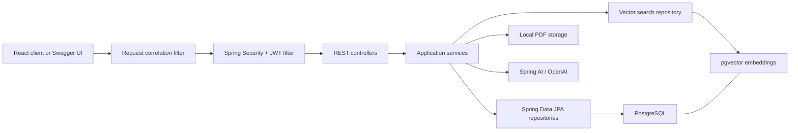
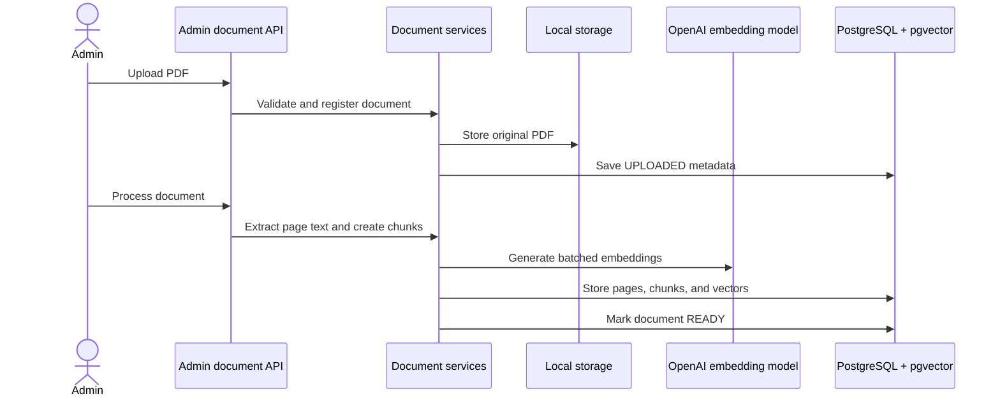
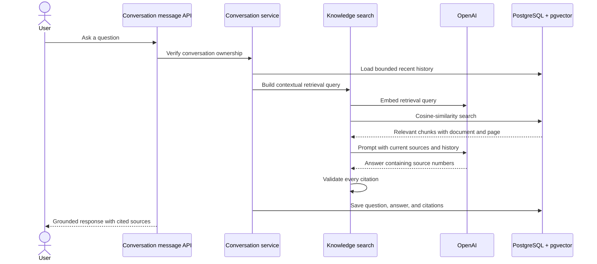

# AI Support Agent

A production-minded Spring Boot application for an internal knowledge assistant. Administrators upload PDF documents, and authenticated employees ask questions that are answered only from the uploaded knowledge base with document and page citations. A React and TypeScript client lives in `frontend/` and is being developed as an independently buildable interface for the API.

The project demonstrates a complete retrieval-augmented generation (RAG) workflow rather than sending an ungrounded prompt directly to a language model.

## Why this project exists

Companies often keep important information across employee handbooks, support manuals, policies, FAQs, and technical documentation. Finding the correct passage manually is slow, and a general-purpose AI model may confidently invent an answer.

This application turns company PDFs into a searchable knowledge base. It retrieves the most relevant passages before asking the model to answer, rejects unsupported responses, and preserves the resulting conversation and citations.

## Features

- User registration and login with BCrypt password hashing
- Stateless JWT access-token authentication
- Database-backed refresh tokens with hashing, rotation, expiration, and revocation
- `EMPLOYEE` and `ADMIN` role-based authorization
- Admin-only PDF upload, processing, listing, retrieval, and deletion
- PDF text extraction with page-level provenance
- Configurable document chunking and batched OpenAI embeddings
- PostgreSQL vector storage and cosine-similarity search with pgvector
- Grounded OpenAI responses with validated source citations
- User-owned conversations with bounded follow-up context
- Persisted user messages, AI responses, and citation history
- Request validation and centralized JSON exception handling
- Flyway database migrations
- OpenAPI 3.0 documentation and Swagger UI
- Actuator liveness and database-aware readiness checks
- Validated request correlation IDs and structured ECS container logs
- Unit and Testcontainers integration tests with enforced JaCoCo coverage
- GitHub Actions CI for tests and production-image build verification
- Multi-stage, non-root application container with a read-only root filesystem
- Docker Compose stack for the application, PostgreSQL/pgvector, and pgAdmin
- Independently buildable React, TypeScript, and Vite frontend foundation

## Architecture



The controllers translate HTTP requests into application calls. Services own business rules and authorization. JPA repositories handle relational persistence, while a focused JDBC repository performs pgvector-specific batch updates and similarity queries.

## Request flows

### Document ingestion



The upload and processing operations are separate. This gives the document a visible lifecycle—`UPLOADED`, `PROCESSING`, `READY`, or `FAILED`—and makes failures easier to inspect and retry.

### Grounded conversation answer



Retrieved document text and conversation history are treated as untrusted input. The system prompt tells the model not to follow instructions found inside those sources, and the application rejects missing or unknown citations.

## Package structure

```text
src/main/java/org/brian/aisupportagent/
├── config/       Spring, security, JWT, RAG, storage, and OpenAPI configuration
├── controller/   HTTP endpoints and request/response mapping
├── dto/          Validated API request and response contracts
├── entity/       JPA entities and domain enums
├── exception/    Domain exceptions and centralized HTTP error handling
├── repository/   Spring Data JPA and pgvector persistence
├── security/     JWT filter and JSON authentication/authorization handlers
├── service/      Business logic, transactions, RAG, and authorization
└── util/         Reusable document validation
```

Database migrations live in `src/main/resources/db/migration`, and tests mirror the main application under `src/test/java`.

Container build instructions live in `docker/Dockerfile`; `docker-compose.yml` assembles the application and its development infrastructure.

## Data model

| Entity | Responsibility |
| --- | --- |
| `User` | Identity, BCrypt password hash, and role |
| `RefreshToken` | One hashed, revocable refresh token per user |
| `KnowledgeDocument` | Uploaded-file metadata and processing state |
| `KnowledgeDocumentPage` | Extracted text with its original PDF page number |
| `KnowledgeDocumentChunk` | Searchable text segment and 1,536-dimension vector |
| `Conversation` | User-owned conversation and title |
| `ConversationMessage` | Ordered user or assistant message |
| `ConversationMessageCitation` | Immutable source snapshot attached to an AI answer |

Flyway is the source of truth for the database schema. Hibernate uses `ddl-auto=validate`, so startup fails if the entity mappings and migrations disagree instead of silently altering the database.

## Technology stack

| Area | Technology |
| --- | --- |
| Language | Java 21 |
| Framework | Spring Boot 4.1, Spring MVC |
| AI | Spring AI 2.0, OpenAI chat and embedding models |
| Security | Spring Security, JJWT, BCrypt |
| Persistence | Spring Data JPA, Hibernate, JDBC |
| Database | PostgreSQL 16, pgvector |
| Migrations | Flyway |
| API documentation | springdoc-openapi, Swagger UI |
| Testing | JUnit 5, Mockito, MockMvc, Testcontainers, JaCoCo |
| Operations | Actuator health probes, correlation IDs, structured ECS logs |
| Infrastructure | Multi-stage Docker image, Docker Compose, pgAdmin, GitHub Actions CI |
| Build | Maven Wrapper |

## Security design

- Registration always creates an `EMPLOYEE`; public users cannot self-assign `ADMIN`.
- Access tokens expire after 15 minutes and are signed with a Base64-encoded secret containing at least 32 random bytes.
- Refresh tokens are random opaque values that expire after seven days.
- Only SHA-256 refresh-token hashes are stored in the database.
- Refreshing rotates the token, so the previous value cannot be reused.
- Logout revokes the presented refresh token.
- The JWT filter loads the current user from the database on every authenticated request, so deleted users and role changes take effect without relying only on stale token claims.
- URL rules require authentication for `/api/**`, and service-layer `@PreAuthorize` rules protect admin operations and business entry points.
- Authentication and authorization failures use consistent JSON responses.

## Prerequisites

- Java 21
- Docker Desktop with Docker Compose
- An OpenAI API key
- Git

The Maven Wrapper is included, so a separate Maven installation is not required.

## Local setup

### 1. Create local environment configuration

From the repository root:

```bash
cp .env.example .env
```

Generate a JWT signing secret:

```bash
openssl rand -base64 32
```

Put the generated value in `JWT_SECRET`, choose local database and pgAdmin passwords, and add your OpenAI API key. The real `.env` file is ignored by Git.

### 2. Choose how to run the application

#### Option A: Run the complete Docker stack

```bash
docker compose up --build -d
docker compose ps
```

Compose builds the Spring Boot image, starts PostgreSQL, waits for database health, and then starts the application. The application is healthy only after its database-aware readiness endpoint reports `UP`.

Follow application logs with:

```bash
docker compose logs -f app
```

Services:

| Service | Address |
| --- | --- |
| Application | `http://localhost:8080` |
| Readiness | `http://localhost:8080/actuator/health/readiness` |
| PostgreSQL | `localhost:5432` |
| pgAdmin | `http://localhost:5050` |

The PostgreSQL service must show the `pgvector/pgvector:0.8.2-pg16` image. Database records and uploaded PDFs use separate named volumes, so ordinary container recreation does not delete them.

Stop the stack while preserving both volumes with:

```bash
docker compose down
```

#### Option B: Run infrastructure in Docker and Spring Boot in IntelliJ

Start only the dependencies:

```bash
docker compose up -d postgres pgadmin
```

Open `AiSupportAgentApplication` and create a Spring Boot run configuration. IntelliJ does not automatically load the repository's `.env` file, so add these required environment variables to the run configuration:

```text
DB_URL
DB_USERNAME
DB_PASSWORD
JWT_SECRET
OPENAI_API_KEY
```

Run the application and wait for both messages:

```text
Tomcat started on port 8080
Started AiSupportAgentApplication
```

Do not start the Compose `app` service at the same time as IntelliJ unless you change `APP_PORT`; both otherwise publish port 8080.

### 3. Connect pgAdmin

Register the database in pgAdmin with:

| Setting | Value |
| --- | --- |
| Host | `postgres` |
| Port | `5432` |
| Maintenance database | Value of `POSTGRES_DB` |
| Username | Value of `DB_USERNAME` |
| Password | Value of `DB_PASSWORD` |

Use `postgres` as the host because pgAdmin and PostgreSQL are containers on the same Compose network. An application running from IntelliJ uses `localhost` through the published host port.

### 4. Open the API documentation

- Swagger UI: `http://localhost:8080/swagger-ui.html`
- OpenAPI JSON: `http://localhost:8080/v3/api-docs`

Swagger UI can call the public registration and login endpoints without a token. For protected endpoints, copy the returned `accessToken`, click **Authorize**, and paste the raw token. Swagger adds the `Bearer` prefix.

## Create a local administrator

Registration intentionally creates only employees. For local development, register a user and then promote that account directly in PostgreSQL:

```sql
UPDATE users
SET role = 'ADMIN'
WHERE email = 'your-email@example.com';
```

This manual promotion is for local development only. A production system would use a controlled provisioning or invitation workflow with an audit trail.

## Suggested demo workflow

Use Swagger UI to demonstrate the complete application:

1. Register a user with `POST /api/auth/register`.
2. Promote that user to `ADMIN` in the local database.
3. Log in with `POST /api/auth/login` and authorize Swagger with the new access token.
4. Upload a PDF with `POST /api/admin/documents`.
5. Process it with `POST /api/admin/documents/{documentId}/process`.
6. Create a conversation with `POST /api/conversations`.
7. Ask a grounded question with `POST /api/conversations/{conversationId}/messages`.
8. Ask a follow-up question that depends on recent conversation context.
9. Retrieve the message history and inspect each persisted citation.

## API overview

| Method | Path | Access | Purpose |
| --- | --- | --- | --- |
| `POST` | `/api/auth/register` | Public | Register an employee and issue tokens |
| `POST` | `/api/auth/login` | Public | Authenticate and issue tokens |
| `POST` | `/api/auth/refresh` | Public | Rotate a refresh token and issue new tokens |
| `POST` | `/api/auth/logout` | Public | Revoke a refresh token |
| `GET` | `/api/users/me` | Authenticated | Read the current user profile |
| `GET` | `/api/admin/users` | Admin | List users |
| `GET` | `/api/admin/documents` | Admin | List documents with pagination |
| `POST` | `/api/admin/documents` | Admin | Upload a PDF |
| `GET` | `/api/admin/documents/{documentId}` | Admin | Read document details |
| `POST` | `/api/admin/documents/{documentId}/process` | Admin | Extract, chunk, and embed a document |
| `DELETE` | `/api/admin/documents/{documentId}` | Admin | Delete metadata and the stored file |
| `POST` | `/api/knowledge/search` | Authenticated | Search relevant knowledge chunks |
| `POST` | `/api/knowledge/ask` | Authenticated | Generate a one-off grounded answer |
| `POST` | `/api/conversations` | Authenticated | Create a conversation |
| `GET` | `/api/conversations` | Authenticated | List owned conversations with pagination |
| `GET` | `/api/conversations/{conversationId}` | Owner | Read an owned conversation |
| `PATCH` | `/api/conversations/{conversationId}` | Owner | Rename an owned conversation |
| `DELETE` | `/api/conversations/{conversationId}` | Owner | Delete an owned conversation and its history |
| `POST` | `/api/conversations/{conversationId}/messages` | Owner | Ask a grounded conversational question |
| `GET` | `/api/conversations/{conversationId}/messages` | Owner | Read paginated message and citation history |

## Configuration

Required variables have no application default. Optional values are shown with their defaults.

| Variable | Required | Default | Purpose |
| --- | --- | --- | --- |
| `DB_URL` | Yes | — | JDBC PostgreSQL URL |
| `DB_USERNAME` | Yes | — | Database and Compose user |
| `DB_PASSWORD` | Yes | — | Database and Compose password |
| `JWT_SECRET` | Yes | — | Base64-encoded JWT signing key |
| `OPENAI_API_KEY` | Yes | — | OpenAI authentication |
| `APP_PORT` | No | `8080` | Compose application host port |
| `POSTGRES_PORT` | No | `5432` | Compose PostgreSQL host port |
| `PGADMIN_PORT` | No | `5050` | Compose pgAdmin host port |
| `LOGGING_STRUCTURED_FORMAT_CONSOLE` | No | Compose: `ecs` | Container console-log format; leave unset for readable IntelliJ logs |
| `SPRING_SECURITY_LOG_LEVEL` | No | `INFO` | Spring Security log verbosity |
| `SPRING_JPA_SHOW_SQL` | No | `false` | Print Hibernate SQL for temporary local debugging |
| `OPENAI_CHAT_MODEL` | No | `gpt-5-mini` | Answer-generation model |
| `OPENAI_CHAT_MAX_COMPLETION_TOKENS` | No | `600` | Maximum answer tokens |
| `OPENAI_CHAT_REASONING_EFFORT` | No | `low` | Chat-model reasoning effort |
| `DOCUMENT_STORAGE_PATH` | No | `./data/documents` | Host-run uploaded PDF storage; Compose uses its document volume |
| `DOCUMENT_MAX_FILE_SIZE` | No | `10MB` | File validation and multipart limit |
| `DOCUMENT_MAX_REQUEST_SIZE` | No | `11MB` | Multipart request limit |
| `RAG_CHUNK_TARGET_TOKENS` | No | `500` | Target chunk size |
| `RAG_SEARCH_DEFAULT_RESULTS` | No | `5` | Retrieved source limit |
| `RAG_SEARCH_MINIMUM_SIMILARITY` | No | `0.70` | Minimum cosine similarity |
| `CONVERSATION_HISTORY_MAX_MESSAGES` | No | `10` | Context message limit |
| `CONVERSATION_HISTORY_MAX_CHARACTERS` | No | `12000` | Context character limit |
| `SPRINGDOC_API_DOCS_ENABLED` | No | `true` | Enable OpenAPI JSON |
| `SPRINGDOC_SWAGGER_UI_ENABLED` | No | `true` | Enable Swagger UI |

The embedding model and vector column both use 1,536 dimensions. Changing that dimension requires a coordinated model, configuration, and database migration change.

## Testing

Run the complete suite:

```bash
./mvnw verify
```

The test strategy includes:

- Focused unit tests for authentication, tokens, storage, extraction, chunking, embeddings, retrieval, answers, and conversations
- Bean Validation tests for API request contracts
- MockMvc integration tests for HTTP status codes, JSON contracts, JWT security, role authorization, ownership boundaries, document lifecycle, RAG flows, and OpenAPI
- Testcontainers with a real PostgreSQL/pgvector database and Flyway migrations
- Mocked OpenAI chat and embedding models so tests are deterministic and do not spend API credits

Docker must be running for the container-backed integration tests. Tests marked with `disabledWithoutDocker` are skipped when Docker is unavailable.

The `verify` phase also generates a JaCoCo report at `target/site/jacoco/index.html` and enforces bundle-wide minimums of 90% line coverage and 70% branch coverage. All production packages are included. A coverage gate prevents the test suite from becoming less effective over time, but a covered line still needs meaningful assertions to prove correct behavior.

## Continuous integration

The `.github/workflows/ci.yml` workflow runs for pull requests targeting `main`, pushes to `main`, and manual dispatches. It performs two ordered jobs:

1. Configure Java 21, restore the Maven dependency cache, confirm Docker is available, and run `./mvnw verify`. Docker availability ensures the Testcontainers integration tests run instead of being skipped. JaCoCo then generates and checks the coverage report, which GitHub retains as a downloadable workflow artifact for 14 days.
2. After every test passes, build `docker/Dockerfile` without publishing the image. This verifies that the same production image used by Docker Compose remains buildable.

The workflow uses read-only repository permissions and does not require an OpenAI key, JWT secret, database password, or container-registry credentials. Tests provide isolated test configuration, mock OpenAI models, and create a temporary PostgreSQL/pgvector database through Testcontainers.

## Operational logging

Every HTTP response includes an `X-Request-ID`. A client-supplied ID is preserved only when it contains 1–100 letters, digits, periods, underscores, or hyphens; otherwise the application generates a UUID. The filter places the value in SLF4J's Mapped Diagnostic Context (MDC) before Spring Security runs and always removes it afterward so servlet threads cannot leak request context into later work.

Completed non-health requests produce one access-log event containing the HTTP method, URI path, response status, and duration. Request bodies, query strings, authorization headers, JWTs, and user questions are deliberately excluded.

IntelliJ uses readable console logs containing the request ID. Docker Compose defaults to Spring Boot's Elastic Common Schema (ECS) JSON format, which includes MDC and structured key-value fields and can be ingested by centralized logging platforms. SQL statements and Spring Security DEBUG output are disabled by default but can be enabled temporarily through environment configuration.

## Error handling

`GlobalExceptionHandler` converts validation, domain, storage, AI, and persistence failures into a consistent `ApiErrorResponse`. Spring Security uses separate handlers for unauthenticated (`401`) and unauthorized (`403`) requests because security failures can occur before a controller is reached.

This separation is important: controller advice handles MVC exceptions, while authentication entry points and access-denied handlers handle failures inside the security filter chain.

## Troubleshooting

### `extension "vector" is not available`

An older plain PostgreSQL container may still be running. Confirm the Compose image with `docker compose ps`. Recreate only the database container with:

```bash
docker compose up -d --force-recreate postgres
```

The named database volume is preserved. Do not add `-v` to `docker compose down` unless you intentionally want to delete all local database data.

### The application cannot find environment variables

Docker Compose reads `.env`, but IntelliJ does not load it automatically. Add the required values to the Spring Boot run configuration.

### A container is unhealthy

Inspect the failing service and its recent logs:

```bash
docker compose ps
docker compose logs --tail=200 app postgres
```

PostgreSQL readiness is checked with `pg_isready`. Application readiness is checked through `/actuator/health/readiness` and includes Spring's readiness state, database connectivity, and disk space.

### Port 5432, 5050, or 8080 is already in use

Stop the conflicting local process or change `POSTGRES_PORT`, `PGADMIN_PORT`, or `APP_PORT` in `.env`. If the database port changes for an IntelliJ-run application, update `DB_URL` too; container-to-container traffic continues using port 5432.

### The AI request fails

Confirm that `OPENAI_API_KEY` is present, the account can use the configured models, and the document reached `READY` before searching it.

## Current limitations and roadmap

- Document processing is synchronous; a production version should use background jobs with retry and progress reporting.
- Files use local disk storage; production deployment should use durable object storage such as S3-compatible storage.
- The application still needs rate limiting and production metrics/tracing beyond its health and structured logging foundation.
- Administrator provisioning is manual in local development and needs a controlled audited workflow.
- The backend has no frontend yet; Swagger UI is the current interactive client.
- Compose provides a strong single-host deployment baseline, but production still needs managed secrets, TLS, an image registry, backups, and an orchestration or hosting strategy.
- Retrieval quality should eventually be evaluated with a repeatable question-and-answer dataset rather than intuition alone.

## FAQs

1. **Why RAG?** It grounds answers in company-controlled data, reduces hallucinations, and provides traceable evidence.
2. **Why store pages separately from chunks?** Pages preserve human-readable citation provenance; chunks provide model-sized retrieval units.
3. **Why JPA plus JDBC?** JPA handles the relational domain cleanly, while explicit JDBC keeps pgvector-specific SQL visible and controllable.
4. **Why service-layer authorization?** Business operations remain protected even if they are later called through a different controller or entry point.
5. **Why rotate refresh tokens?** A captured old token stops working after successful use, reducing replay risk.
6. **Why persist citation snapshots?** Conversation history remains explainable even if the underlying document is later changed or removed.
7. **How is prompt injection addressed?** Retrieved documents and prior messages are delimited as untrusted context, and model citations are validated before returning or persisting an answer.
8. **How is schema drift prevented?** Flyway owns schema evolution and Hibernate validates mappings at startup.
9. **How is the container hardened?** A multi-stage build keeps build tools out of the runtime image; the process runs as a non-root user with a read-only root filesystem, a writable document volume, a temporary filesystem, and no-new-privileges enabled.
10. **How are requests traced through logs?** A highest-priority filter validates or generates an `X-Request-ID`, stores it in MDC across security and application processing, returns it to the caller, and removes it in a `finally` block. Docker emits the result as structured ECS JSON.
